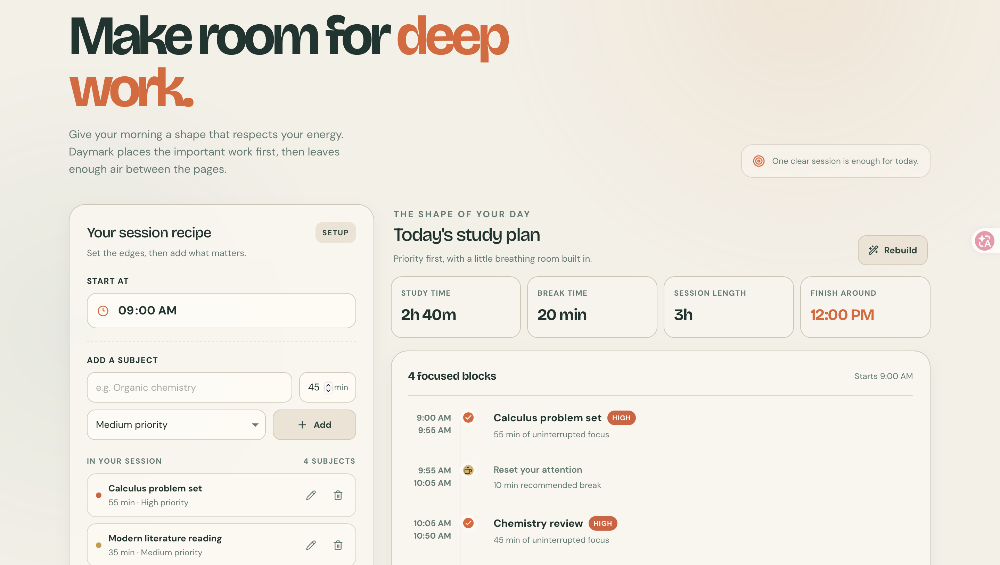

# Study Planner

Study Planner is my first Python project.

The goal of this project is to create a simple tool that helps students organize their study sessions.

## Current features

- Choose a subject to study
- Choose how many minutes to study
- Generate a simple study plan

## Future improvements

- Add multiple subjects
- Create study priorities
- Calculate break times
- Save study sessions
- Track study progress

## Why I created this project

I am learning Python and Computer Science independently. I created this project to practice programming while building something useful for students.
## Live Demo

You can try the app here:

https://study-planner-web-app--lucaslopescoelh.replit.app

## What I learned

While building this project, I practiced:

- Python basics
- User input
- Lists and dictionaries
- Loops and conditional logic
- Sorting data by priority
- Time calculations
- Building and deploying a working application

